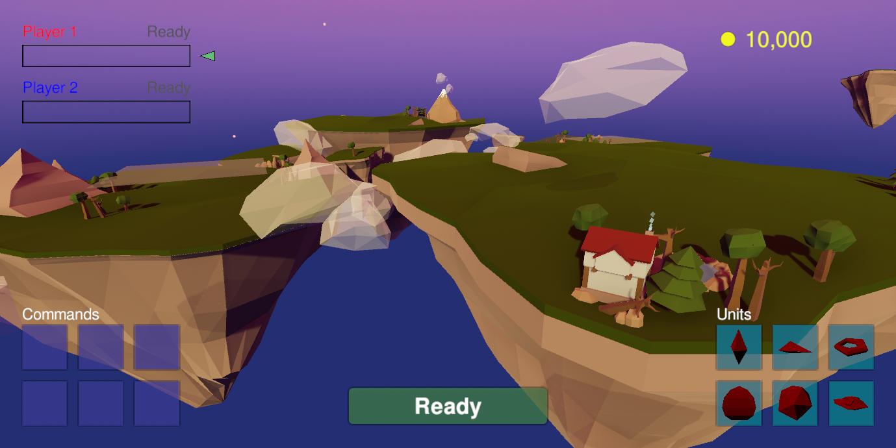

 

  

  <h3 align="center">Battleboids</h3>

  

    A university project and a strategic battle simulator featuring boid simulations.
  

  
Table of Contents

  <ol>
    <li>
      <a href="#about-the-project">About The Project</a>
      <ul>
        <li><a href="#concept">Concept</a></li>
        <li><a href="#built-with">Built With</a></li>
      </ul>
    </li>
    <li>
      <a href="#getting-started">Getting Started</a>
      <ul>
        <li><a href="#prerequisites">Prerequisites</a></li>
        <li><a href="#installation">Installation</a></li>
      </ul>
    </li>
    <li><a href="#roadmap">Roadmap</a></li>
    <li><a href="#contact">Contact</a></li>
  </ol>

## About The Project

BattleBoids is still a work in progress. The game is the main focus of a bachelor's thesis at the Chalmers University of Technology and the University of Gothenburg. The thesis description can be found [here](https://www.chalmers.se/SiteCollectionDocuments/CSE/Kandidatprojekt2021/Datx02-21-04_Procedural_game.pdf). 

The game uses real-time flocking simulations as one of its core game mechanics. The implementation is directly based on the model described by Craig Reynolds in his 1987 paper, ["Flocks, Herds, and Schools: A Distributed Behavioral Model"](https://www.red3d.com/cwr/papers/1987/boids.html), wherein he details how complex flocking behavior can arise from a small set of simple rules. The project started with a theoretical examination of these rules and the possible game concepts they could be used for. In the end, to get the most out of the complexities of flocking behaviors, we decided to create a game where two players compose a flock each using a few available different units. These two flocks then fight on a battlefield. Once the battle has started, the game is purely a simulation: the challenge for the players is to create a strong flock composition that will counter the opposing flock.

The game also features a short campaign mode. This mode is single-player and allows the player to play against a few predefined enemy flocks. This game mode introduces new units as the player progresses.

Accompanying the project, we'll write a scientific report detailing the theory behind the project, our methods, and the results. Once this report is finished, it will be uploaded to this repository and a link will be included here.

### Concept

When an entity is given the three forces as outlined in Reynolds paper (Collision Avoidance, Velocity Matching, and Flock Centering), and placed in a 3D euclidean space together with other entities, the entities begin to move in a way that resembles a school of fish or a flock of birds. This is interesting as it suggests that complex flock movement is in reality very simple and can be simulated using minimal computing power. However, the computing power required increases drastically as the number of simulated entities increase. 

The Project's objective is to take this fact and create a game around flocking behavior while using appropriate data structures and multi-threading to simulate a large number of entities.

We expand on Craig Reynolds' original three rules, and introduce additional rules, or "behaviors", that govern the boids. Each behavior has accompanying weights, ranges, or strengths, that can vary among boids. This allows us to create different classes of boids. 

With these different boid classes and the battle mechanic, we hope to highlight the intricacies of flocking in a more nuanced and eventful environment than a regular flocking simulation.

### Built With

The game is built using the [Unity](https://unity.com/) game engine and uses a variety of add-ons to enable a large number of boids simulated, particularly [Burst](https://unity.com/dots/packages#burst-compiler) from the unity [Dots project](https://unity.com/dots).

## Getting Started

To get started, simply clone the repository and open it up with unity. The game is in development and hence some functionality may not yet be implemented, and many bugs may remain. 

### Prerequisites

[Unity version 2020.2.2f1](https://unity3d.com/unity/whats-new/2020.2.2)

### Installation 
At this point, there are no released binaries. A release will be published in this repository when the project is ready.

## Roadmap
The game aims to be completed sometime during March 2021. The final report, a release of the game, and possible documentation will be published at a later stage.

## Contact
Anton Ahl - [Github](https://github.com/ahanton) - ahanton@student.chalmers.se

Anton Hildingsson - [Github](https://github.com/palmdrop) - gushilanb@student.gu.se

Frans Bergman - [Github](https://github.com/frans-bergman) - fransb@student.chalmers.se

Joachim Ørfeldt Pedersen - [Github](https://github.com/feldtsen) - gusrfejo@student.gu.se

Johannes Kvernes - [Github](https://github.com/Jononannes) - kvernes@student.chalmers.se

Vidar Höök - [Github](https://github.com/VidarHook) - vidarho@student.chalmers.se

Project Link: [https://github.com/palmdrop/BattleBoids](https://github.com/palmdrop/BattleBoids)

