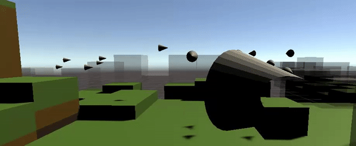

 

  

  <h3 align="center">Battleboids</h3>

  

    A university project strategy game featuring boid simulations.
  

  
Table of Contents

  <ol>
    <li>
      <a href="#about-the-project">About The Project</a>
      <ul>
        <li><a href="#concept">Concept</a></li>
        <li><a href="#built-with">Built With</a></li>
      </ul>
    </li>
    <li>
      <a href="#getting-started">Getting Started</a>
      <ul>
        <li><a href="#prerequisites">Prerequisites</a></li>
      </ul>
    </li>
    <li><a href="#roadmap">Roadmap</a></li>
    <li><a href="#contact">Contact</a></li>
  </ol>

## About The Project

Battleboids is a work in progress game built using the Unity game engine and is the main focus of a bachelor's thesis at Chalmers university of technology and the University of Gothenburg.

The game revolves around boid simulation behaviour as described by Craig Reynolds in his 1987 paper, "Flocks, Herds, and Schools: A Distributed Behavioral Model", wherein he details how complex flocking behaviour can arise from a very small set of simple rules that each entity has to follow. The game attempts to modify these rules and implement new ones so that different flocks can be placed strategically on a map and simulate a battle between flocks of other players.

### Concept

When an entity is given the three forces as outligned in Reynolds paper (Collision Avoidance, Velocity Matching, and Flock Centering), and placed in a 3D euclidean space together with other entities, the entities begin to move in a way that resembles a school of fish or a flock of birds. This is interesting as it suggests that complex flock movement is in reality very simple and can be simulated using minimal computing power. The Project's objective is to take this fact and create a game around flocking behaviour while using appropriate data structures and multi-threading to simulate a large amount of entities.

### Built With

The game is built using the [Unity](https://unity.com/) game engine, and uses a variety of add-ons to enable a large amount of boids simulated, particularly [Burst](https://unity.com/dots/packages#burst-compiler) from the unity [Dots project](https://unity.com/dots).

## Getting Started

To get started, simply clone the repository and open up with unity. The game is in development and is not yet playable.

### Prerequisites

[Unity version 2020.2.2f1](https://unity3d.com/unity/whats-new/2020.2.2)

## Roadmap

The game aims to be completed some time during March 2021.

## Contact

Anton Ahl - [Github](https://github.com/ahanton) - ahanton@student.chalmers.se

Anton Hildingsson - [Github](https://github.com/palmdrop) - gushilanb@student.gu.se

Frans Bergman - [Github](https://github.com/frans-bergman) - fransb@student.chalmers.se

Joachim Ørfeldt Pedersen - [Github](https://github.com/feldtsen) - gusrfejo@student.gu.se

Johannes Kvernes - [Github](https://github.com/Jononannes) - kvernes@student.chalmers.se

Vidar Höök - [Github](https://github.com/VidarHook) - vidarho@student.chalmers.se

Project Link: [https://github.com/palmdrop/BattleBoids](https://github.com/palmdrop/BattleBoids)